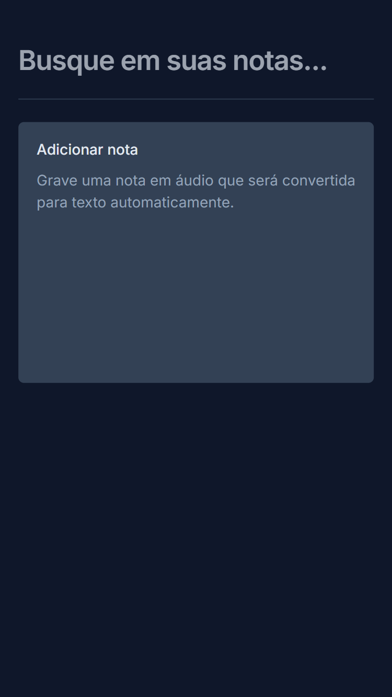
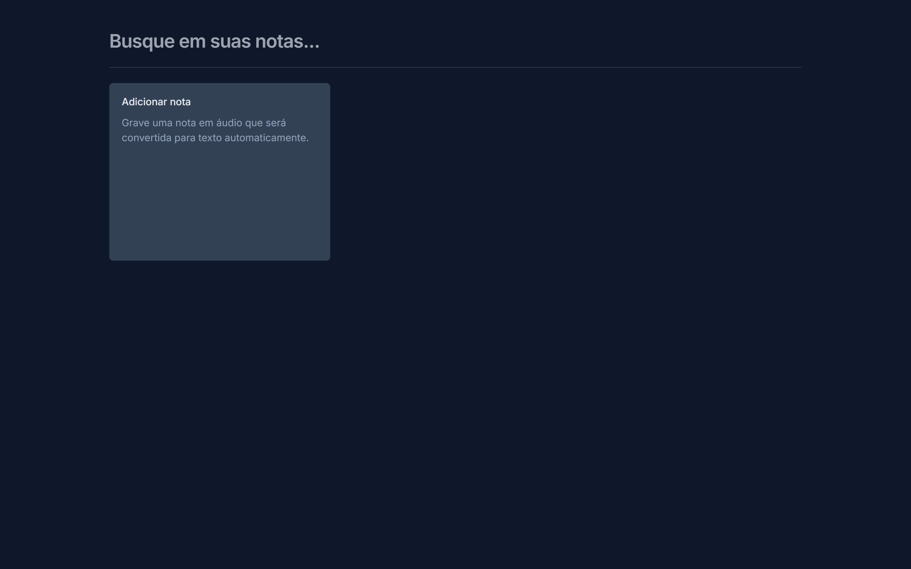

<h1 align="center">
  My Notes
</h1>

<ul>
  <li>
    <a href="#sobre-o-projeto">
      ❓ Sobre o projeto
    </a>
  </li>
  <li>
    <a href="#tecnologias">
      🛠️ Tecnologias
    </a>
  </li>
  <li>
    <a href="#pre-requisitos">
      ☕ Pré-requisitos
    </a>
  </li>
  <li>
    <a href="#como-instalar-o-projeto">
      ⚙️ Como instalar o projeto
    </a>
  </li>
  <li>
    <a href="#como-executar-o-projeto">
      🚀 Como executar o projeto
    </a>
  </li>
  <li>
    <a href="#demonstração-da-aplicação">
      🌐 Demonstração da aplicação
    </a>
  </li>
  <li>
    <a href="#autor">
      👨‍💻 Autor
    </a>
  </li>
  <li>
    <a href="#licença">
      📝 Licença
    </a>
  </li>
</ul>

<p align="center">
  
</p>

<br />

<br />

<p align="center">
  
</p>

## ❓ Sobre o projeto

My Notes é um editor de notas web que converte automaticamente notas de áudio em texto com React, TypeScript, Tailwind CSS e a SpeechRecognition API.

## 🛠️ Tecnologias

O projeto foi desenvolvido com as seguintes tecnologias:

- [React](https://react.dev/)
- [TypeScript](https://www.typescriptlang.org/)
- [Tailwind CSS](https://tailwindcss.com/)
- [SpeechRecognition API](https://developer.mozilla.org/en-US/docs/Web/API/SpeechRecognition)

## ☕ Pré-requisitos

Verifique aos seguintes pré-requisitos para poder instalar e executar o projeto:

1. Ter instalado um editor de código:
   - [VS Code](https://code.visualstudio.com/download)
   - [Sublime Text](https://www.sublimetext.com/download)
   - [Notepad++](https://notepad-plus-plus.org/downloads)
2. Ter instalado o [Git](https://git-scm.com/downloads)
3. Ter instalado o [Node.js](https://nodejs.org/en)

## ⚙️ Como instalar o projeto

Siga o passo a passo para instalar o projeto:

1. Abra o terminal e clone o repositório do projeto:

```bash
git clone https://github.com/pedroeuzebiojs/my-notes
```

## 🚀 Como executar o projeto

Siga o passo a passo para executar o projeto:

1. Entre na pasta do projeto clonado:

```bash
cd my-notes
```

2. Abra a pasta do projeto clonado no editor de código de sua preferência. Caso seja o VS Code digite o comando:

```bash
code .
```

3. Instale as depências do projeto:

```bash
npm install
```

4. Execute a aplicação localmente:

```bash
npm run dev
```

5. Acesse [http://localhost:5173](http://localhost:5173) para visualizar a aplicação

## 🌐 Demonstração da aplicação

- [Exibir projeto](https://my-notes-web-app)

## 👨‍💻 Autor

<table>
  <tr>
    <td align="center">
      <a href="https://github.com/pedroeuzebiojs">
        
      </a>
      <br />
      Pedro Euzebio
    </td>
  </tr>
</table>

## 📝 Licença

O projeto está sob licença MIT. Veja o arquivo [LICENSE](./LICENSE) para mais detalhes.
